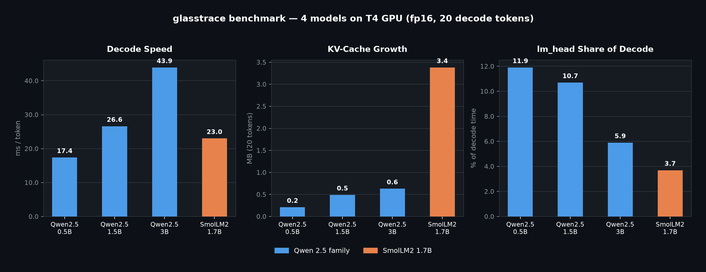

# glasstrace

[](https://github.com/manu-j3400/glasstrace/actions/workflows/ci.yml)
[](https://pypi.org/project/glasstrace/)
[](https://pypi.org/project/glasstrace/)
[](https://opensource.org/licenses/MIT)

> Per-layer latency and memory profiler for transformer inference.

## Why

Most LLM inference tools give you total latency and call it a day.
That's not enough if you actually want to know what's slow.
glasstrace hooks into your model and tells you where the time goes,
split by layer and by inference phase.

## Install

```bash
pip install glasstrace
```

## Quick start

### Input

```python
import glasstrace
from transformers import AutoModelForCausalLM, AutoTokenizer
import torch

model = AutoModelForCausalLM.from_pretrained("Qwen/Qwen2.5-0.5B").to("cuda")
tokenizer = AutoTokenizer.from_pretrained("Qwen/Qwen2.5-0.5B")
inputs = tokenizer("Hello, world!", return_tensors="pt").to("cuda")

def warmup():
    model.generate(**inputs, max_new_tokens=5, do_sample=False)

with glasstrace.profile(model, warmup=warmup) as p:
    with torch.no_grad():
        model.generate(**inputs, max_new_tokens=20, do_sample=False)

print(p.report())
```

### Output:

<pre>
glasstrace report
  modules profiled: 169
  total events: 3380
  total measured time: 383.48 ms
  device: cuda
  kv-cache growth during decode: 0.2 MB

── prefill (1 pass, 69.7 ms total) ──────────────────────────────────────
Module                         Type    Calls  Total ms  % of phase
model.layers.0.mlp.down_proj   Linear      1      1.78        2.6%
...

── decode (20 passes, 314.7 ms total, 15.7 ms/token avg) ────────────────
Module                         Type    Calls  Total ms  % of phase
lm_head                        Linear     20     37.48       11.9%
model.layers.0.mlp.gate_proj   Linear     19      2.29        0.6%
...
</pre>


## Benchmark

4 models on a T4 GPU — fp16, 20 decode tokens, same prompt:



Three things stand out from the data:
- Decode speed scales sub-linearly with size. Qwen 3B is 6x larger than 0.5B but only 2.5x slower per token.
- KV-cache growth is about architecture, not parameter count. SmolLM2 1.7B grows its cache 6.8x faster than Qwen 1.5B at similar size.
- lm_head's share of decode shrinks as models get deeper because the body scales faster than the vocab projection.

## How it works

glasstrace registers forward hooks on every `nn.Linear` and
`nn.LayerNorm` in your model. On CUDA it uses `torch.cuda.Event`
for GPU timing — wall-clock time is meaningless for async GPU work.
Phase detection is based on the sequence dimension of each layer's
input: `seq_len > 1` is prefill, `seq_len == 1` is decode.

The warmup runs a forward pass before hooks are attached, paying
the one-time GPU initialization cost before measurement starts.

## Roadmap

- [x] v0.1 — per-module CUDA timing, text-table report
- [x] v0.1.1 — warmup phase, cold-start artifact fix
- [x] v0.2 — prefill/decode split, KV-cache tracking, PyPI release
- [x] v0.3 — CLI (`glasstrace profile --model Qwen/Qwen2.5-0.5B`)
- [ ] v0.4 — HTML report with flamegraph
- [ ] v1.0 — extended model coverage, docs site

## License

MIT
